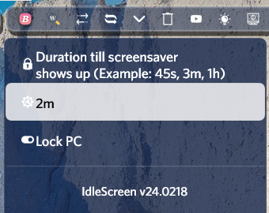

<h1 align="center">
   
  <picture>
  <source media="(prefers-color-scheme: dark)" srcset="Images/LogoLight.png">
  
  </picture>
  <!--a href="#"></a-->
   
  IdleScreen - TheyCallMePapa
   
</h1>

<h4 align="center">Runs a random screensaver after set delay.</h4>

  
  
  
  

  <a href="#key-features">Key Features</a> •
  <a href="#how-to-use">How To Use</a> •
  <a href="#download">Download</a> •
  <a href="#credits">Credits</a> •
  <a href="#license">License</a>

## Key Features
Runs a random screensaver after set delay.  Comes with 12 screensavers.

## How to use
Set the delay in the settings menu.

## Download
https://github.com/papa-boynton/IdleScreen-TheyCallMePapa/releases/tag/latest

## Credits
Written by [TheyCallMePapa](https://github.com/papa-boynton).

## License
Creative Commons Attribution-Non-Commercial-Share Alike 3.0
